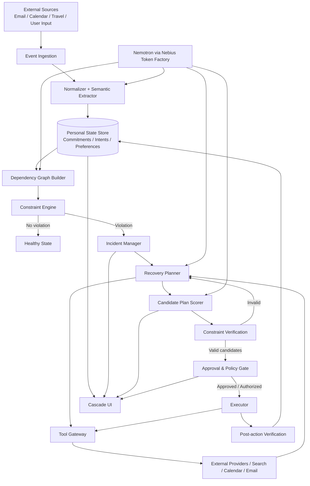

# Cascade — Design & Architecture Specification

**Version:** 0.1  
**Status:** Initial architecture / implementation baseline  
**Track:** Nebius x NVIDIA Global AI Hackathon — Personal AI  
**Working tagline:** **One thing changed. Cascade handles the rest.**

---

## 1. Executive Summary

Cascade is an always-on personal AI system that detects when a real-world change invalidates downstream plans, computes the consequences, and builds the best feasible recovery plan.

The core product thesis is:

> Personal life is a dependency graph, but today's assistants treat each event as an isolated object.

A flight delay can invalidate airport transportation, hotel check-in, dinner, tickets, meetings, and other commitments. The user's current job is to notice every downstream consequence, determine what can still be preserved, search for alternatives, contact affected parties, and rebuild the rest of the plan manually.

Cascade turns that process into:

```text
change
  ↓
propagate consequences
  ↓
detect violated constraints
  ↓
search feasible recoveries
  ↓
compare degraded outcomes
  ↓
request approval where needed
  ↓
execute
  ↓
verify new state
```

Cascade does **not** assume every disruption is fully recoverable. If the original state cannot be restored, it degrades gracefully:

1. Preserve the original commitment.
2. Reschedule it.
3. Substitute another way to satisfy the underlying intent.
4. Compensate for unavoidable loss.
5. Abandon the commitment explicitly when no useful action remains.

The system's objective is therefore not “complete every task.” It is:

> **Given that reality changed, find the highest-value feasible version of the user's plan.**

The architecture deliberately separates deterministic state/constraint logic from LLM reasoning. The LLM is not trusted to decide whether two times overlap or whether a user can physically be in two locations. Deterministic code owns feasibility and propagation. NVIDIA Nemotron models are used for tasks that genuinely require semantic reasoning: extracting commitments from unstructured data, inferring likely dependencies, understanding underlying intent, generating candidate recovery strategies, and comparing nuanced degraded plans.

---

## 2. Goals

### 2.1 Product goals

Cascade should:

- Provide value immediately after data is connected; no long training period is required.
- Detect meaningful changes to user commitments.
- Propagate those changes through explicit downstream dependencies.
- Distinguish the original commitment from the user's underlying intent.
- Produce recovery options that are actually feasible.
- Degrade gracefully when the original plan cannot be recovered.
- Quantify and explain tradeoffs when multiple goals cannot all be preserved.
- Request approval before consequential or irreversible actions.
- Learn user preferences over time without making personalization a prerequisite for usefulness.
- Maintain a complete audit trail of reasoning inputs, deterministic checks, proposed actions, approvals, and outcomes.

### 2.2 Hackathon goals

The implementation should make the use of Nebius and NVIDIA technically obvious:

- NVIDIA Nemotron served through Nebius Token Factory is used at runtime.
- The application is suitable for the Personal AI track: persistent personal state, chosen tools, reusable recovery skills, and cross-workflow execution.
- NVIDIA OpenShell is used for policy-enforced tool execution if feasible within MVP scope.
- Nebius Serverless can host the API/orchestrator and/or finite recovery/evaluation workloads.
- Optional Tavily usage should be functional rather than decorative, e.g. finding live substitutes or policies after a disruption.

### 2.3 Non-goals for MVP

The MVP is **not**:

- A universal personal assistant.
- A full travel booking platform.
- A browser automation framework for every vendor.
- A general-purpose task manager.
- An autonomous agent allowed to spend money freely.
- A system that guarantees every disruption can be repaired.
- A system that infers high-stakes preferences without user review.
- A graph database research project.

---

## 3. Core Design Principles

### 3.1 Deterministic feasibility, agentic recovery

The LLM may propose:

> Move dinner to 8:30 PM.

Deterministic code must verify:

- the proposed reservation is actually available,
- required travel time is satisfied,
- the user is not double-booked,
- hard user constraints are satisfied,
- dependencies remain satisfiable.

An LLM proposal is never considered a valid recovery until the constraint engine accepts it.

### 3.2 Intent is more important than the original artifact

A reservation is not always the real goal.

```text
Original commitment:
Hotel X, check-in at 18:00

Underlying intent:
Have acceptable accommodation tonight.
```

When the exact commitment fails, Cascade should preserve intent when possible.

### 3.3 Explicit failure is a valid outcome

Cascade must be able to conclude:

> No feasible recovery exists under the current constraints.

It should never invent availability or repeatedly hammer external services because the agent is trying to “succeed.”

### 3.4 Autonomy is independent from confidence

Even if Cascade is 99% confident that the user wants a particular action, it cannot execute that action unless the relevant tool permission allows it.

### 3.5 User values win over model values

Cascade may rank plans, but consequential tradeoffs remain visible to the user. The model should explain which commitments must be sacrificed and why.

### 3.6 Bounded search

Recovery planning must have explicit limits:

- maximum recovery depth,
- maximum candidates per broken commitment,
- maximum tool calls,
- maximum wall-clock duration,
- maximum monetary impact,
- maximum retry count.

This avoids unbounded agent loops.

---

## 4. User Mental Model

Cascade revolves around four concepts.

### 4.1 Commitment

A concrete state the user currently expects to happen.

Examples:

- Flight lands at 16:10.
- Airport transfer picks up at 16:45.
- Hotel check-in is expected before 18:00.
- Dinner reservation is at 19:00.
- Movie starts at 21:30.

### 4.2 Intent

The reason a commitment matters.

Examples:

- Reach destination.
- Have transportation from airport.
- Have somewhere to sleep.
- Have a special dinner.
- Have evening entertainment.

Multiple commitments may satisfy the same intent.

### 4.3 Constraint

A condition that must or preferably should hold.

Examples:

```text
flight.arrival + baggage_buffer <= transfer.pickup
hotel.arrival <= hard_checkin_cutoff
hotel.arrival + travel_time <= dinner.start - arrival_buffer
movie.start >= dinner.end + travel_time
```

Constraints can be:

- **Hard** — violating them makes a plan infeasible.
- **Soft** — violating them lowers plan quality but may still be acceptable.

### 4.4 Dependency

A directed relationship indicating that a change to one entity can affect another.

Example:

```text
Flight
  ↓
Transfer
  ↓
Hotel arrival
  ↓
Dinner
  ↓
Movie
```

---

## 5. Recovery Semantics

Every disrupted commitment should end in one of the following resolution states:

| State | Meaning |
|---|---|
| `PRESERVED` | Original commitment remains valid after minor adjustment |
| `RESCHEDULED` | Same provider/activity, different valid time/date |
| `SUBSTITUTED` | Different commitment satisfies the same underlying intent |
| `COMPENSATED` | Goal is lost, but money/credit/waiver is recovered |
| `ABANDONED` | No worthwhile recovery remains |
| `BLOCKED` | Resolution depends on a user decision or external party |
| `AWAITING_APPROVAL` | Feasible action exists but requires user permission |
| `UNRESOLVED` | Search is incomplete or failed unexpectedly |

### 5.1 Recovery hierarchy

For each affected commitment:

```text
PRESERVE
   ↓ if impossible
RESCHEDULE
   ↓ if impossible
SUBSTITUTE
   ↓ if impossible
COMPENSATE
   ↓ if impossible / not useful
ABANDON
```

The planner can skip stages when obviously inappropriate.

### 5.2 Incident severity

| Level | Meaning | Default behavior |
|---|---|---|
| Green | Fully recoverable with low-risk changes | May auto-resolve if authorized |
| Yellow | Recoverable with degradation/substitution | Usually request approval |
| Red | Important goals are mutually incompatible | Present explicit tradeoff |
| Black | Original plan is broadly unrecoverable | Switch to loss mitigation + replanning |

---

## 6. High-Level Architecture



---

## 7. Component Architecture

### 7.1 Event Ingestion Service

Responsibilities:

- Receive webhook events where supported.
- Poll data sources where webhooks are unavailable.
- Accept direct user-created events.
- Support deterministic demo-event injection.
- Deduplicate repeated events.
- Preserve source provenance.

Canonical event envelope:

```json
{
  "event_id": "evt_...",
  "user_id": "usr_...",
  "source": "gmail",
  "source_event_id": "...",
  "event_type": "message.received",
  "occurred_at": "2026-09-10T14:20:00Z",
  "received_at": "2026-09-10T14:20:03Z",
  "payload_ref": "blob_...",
  "content_hash": "...",
  "processing_status": "pending"
}
```

MVP sources:

- User/manual event simulator.
- Calendar.
- Email.
- Mock travel/reservation/ticket providers with realistic provider interfaces.

A real vendor API is not required for every domain. The provider abstraction must make the demo reproducible while still demonstrating real cross-workflow logic.

---

### 7.2 Semantic Normalizer

Unstructured events become typed domain mutations.

Example input:

> “Your flight is now scheduled to arrive at 6:35 PM instead of 4:10 PM.”

Structured output:

```json
{
  "entity_type": "transport_commitment",
  "operation": "UPDATE",
  "match": {
    "provider": "United",
    "flight_number": "UA123",
    "date": "2026-09-11"
  },
  "changes": {
    "scheduled_arrival": {
      "old": "2026-09-11T16:10:00+02:00",
      "new": "2026-09-11T18:35:00+02:00"
    }
  },
  "confidence": 0.98
}
```

Implementation:

- Use structured output with a strict Pydantic/JSON schema.
- Nemotron handles semantic extraction.
- Deterministic validation checks timestamps, identifiers, and allowed operations.
- Low-confidence mutations require confirmation or corroboration before changing authoritative state.

---

### 7.3 Personal State Store

For MVP, use PostgreSQL as the source of truth.

Do **not** introduce Neo4j initially. The graph is small per user and relational persistence is easier to inspect, test, and deploy.

Primary entities:

```text
users
commitments
intents
dependencies
constraints
locations
people
preferences
source_events
incidents
recovery_candidates
recovery_plans
actions
approvals
audit_events
```

Graph traversal can use:

- adjacency queries from the `dependencies` table,
- recursive CTEs for persisted traversal,
- an in-memory NetworkX representation during incident computation.

A graph database can be evaluated later if query complexity justifies it.

---

### 7.4 Commitment Model

Proposed schema:

```python
class Commitment:
    id: UUID
    user_id: UUID

    kind: CommitmentKind
    title: str
    status: CommitmentStatus

    start_at: datetime | None
    end_at: datetime | None
    location_id: UUID | None

    intent_id: UUID | None

    provider: str | None
    external_id: str | None

    monetary_value: Decimal | None
    cancellation_deadline: datetime | None

    importance: float  # 0..1
    flexibility: float  # 0..1
    irreversibility: float  # 0..1

    source: SourceRef
    metadata: dict
```

Important fields should be explicitly sourced rather than silently inferred whenever possible.

---

### 7.5 Intent Model

```python
class Intent:
    id: UUID
    user_id: UUID
    category: str
    description: str

    importance: float
    hard_requirements: list[Requirement]
    soft_preferences: list[PreferenceRef]

    source: Literal["explicit_user", "derived", "learned"]
    confidence: float
```

Example:

```json
{
  "category": "accommodation",
  "description": "Have safe accommodation in Nice tonight",
  "importance": 0.98,
  "hard_requirements": [
    "available tonight",
    "reachable from airport"
  ],
  "soft_preferences": [
    "same neighborhood",
    "similar price",
    "rating >= 4"
  ]
}
```

---

### 7.6 Dependency Graph

Initial edge types:

```text
REQUIRES
BEFORE
AFTER
TRAVEL_TO
SAME_LOCATION
RESOURCE_DEPENDENCY
MUTUALLY_EXCLUSIVE
NOTIFY_IF_CHANGED
DERIVED_FROM
SATISFIES_INTENT
```

Dependency record:

```python
class Dependency:
    from_commitment_id: UUID
    to_commitment_id: UUID
    relation: DependencyType

    hard: bool
    confidence: float

    source: Literal["explicit", "deterministic", "model_inferred"]

    explanation: str | None
```

The LLM may propose dependencies, but they are persisted with provenance and confidence.

Deterministically obvious dependencies should not require LLM calls. For example, two consecutive same-trip events with known locations can generate travel constraints directly.

---

### 7.7 Constraint Engine

This is the trust anchor of Cascade.

Responsibilities:

- Evaluate temporal constraints.
- Evaluate location/travel feasibility.
- Evaluate resource conflicts.
- Evaluate hard user rules.
- Compute affected descendants after state mutations.
- Return machine-readable violations.

Example:

```python
class ConstraintViolation:
    constraint_id: UUID
    affected_commitment_ids: list[UUID]
    severity: Literal["hard", "soft"]

    actual_value: Any
    required_value: Any

    explanation: str
```

Example deterministic rule:

```python
arrival_at_restaurant = hotel_arrival + travel_time(hotel, restaurant)

feasible = arrival_at_restaurant <= (dinner_start - arrival_buffer)
```

The LLM does not determine this boolean.

Travel time should come from a provider/tool when possible and fall back to explicit demo fixtures.

---

### 7.8 Incident Manager

An incident is created when a state mutation introduces one or more new hard violations or materially worsens important soft constraints.

```python
class Incident:
    id: UUID
    user_id: UUID

    trigger_event_id: UUID
    trigger_commitment_id: UUID

    affected_commitment_ids: list[UUID]
    violations: list[ConstraintViolation]

    severity: IncidentSeverity
    status: IncidentStatus

    created_at: datetime
    resolved_at: datetime | None
```

Responsibilities:

1. Compute the blast radius.
2. Group related violations into a single incident.
3. Identify which intents are threatened.
4. Start recovery planning.
5. Avoid duplicate concurrent recovery processes for the same disruption.

---

## 8. Recovery Planner

The Recovery Planner is the key agentic subsystem.

It should **not** ask a model to invent a complete plan in one pass.

Use a structured search process.

### 8.1 Phase A — damage assessment

For every affected commitment:

```text
current state
↓
constraint violations
↓
threatened intent
↓
latest acceptable state
↓
financial / temporal / personal consequences
```

### 8.2 Phase B — generate recovery operators

Recovery operators are typed operations:

```text
SHIFT_TIME
CHANGE_PROVIDER
CHANGE_LOCATION
CANCEL
REFUND
REQUEST_WAIVER
NOTIFY
JOIN_WAITLIST
SUBSTITUTE
REMOVE
DEFER_TO_DATE
```

Each domain adapter declares which operators it supports.

Example:

```python
class RestaurantAdapter:
    capabilities = [CHECK_AVAILABILITY, RESCHEDULE, CANCEL, JOIN_WAITLIST]
```

### 8.3 Phase C — query actual possibilities

A candidate is not valid because the model says it exists.

Example:

```text
Nemotron proposes:
"Try 20:30 at original restaurant"

↓ provider tool

Availability = false

↓ planner

candidate rejected
```

If original-provider options are exhausted, the planner can move to substitutes.

### 8.4 Phase D — build candidate world states

Each valid atomic recovery creates a branch.

Rather than optimizing commitments independently, Cascade evaluates combined states because two individually valid recoveries may conflict with each other.

Example:

```text
Branch A:
  alternate hotel near airport
  cancel dinner
  movie tomorrow

Branch B:
  hotel downtown
  substitute late dinner
  cancel movie

Branch C:
  preserve original hotel
  taxi immediately
  abandon restaurant and movie
```

### 8.5 Phase E — deterministic feasibility pass

Every branch is materialized into a temporary world state and passed through the Constraint Engine.

Only feasible states survive.

### 8.6 Phase F — utility scoring

The planner should use a hybrid score.

Hard constraints are pass/fail.

Soft scoring can include:

```text
score =
    + preserved_intent_value
    + preserved_commitment_value
    + preference_alignment
    + recovered_money

    - monetary_loss
    - inconvenience
    - travel_overhead
    - uncertainty_penalty
    - risk_penalty
    - action_count_penalty
```

Illustrative implementation:

```python
score = (
    0.30 * intent_preservation
    + 0.15 * commitment_preservation
    + 0.15 * preference_alignment
    + 0.10 * normalized_money_recovered
    - 0.10 * inconvenience
    - 0.08 * uncertainty
    - 0.07 * risk
    - 0.05 * action_complexity
)
```

Weights are product defaults, not universal truth. Explicit user preferences may adjust them.

Nemotron may provide a **secondary semantic ranking/explanation** among already-feasible candidate states. It cannot resurrect an infeasible branch.

---

## 9. Handling Unresolvable Cascades

This is a first-class architecture requirement.

### 9.1 Resolution exhaustion

Every recovery attempt records:

```python
class RecoveryAttempt:
    commitment_id: UUID
    stage: RecoveryStage
    operator: RecoveryOperator

    query: dict
    result: dict

    success: bool
    failure_reason: str | None

    attempted_at: datetime
```

A commitment can therefore reach an evidence-backed conclusion:

```json
{
  "commitment": "Restaurant reservation",
  "status": "ABANDONED",
  "exhaustion": {
    "preserve": "missed hard arrival cutoff",
    "reschedule": "no availability in search window",
    "substitute": "user rejected substitutes",
    "compensate": "no fee / nothing to recover"
  }
}
```

### 9.2 Switch from recovery to loss mitigation

When an intent is no longer recoverable:

```text
recover goal
   ✕
minimize damage
   ↓
cancel invalid commitments
recover refunds / credits
notify affected parties
remove stale calendar state
rebuild remaining schedule
```

### 9.3 Mutually incompatible goals

When two important outcomes cannot coexist, Cascade must surface the Pareto frontier instead of hiding a value judgment.

Example:

```text
OPTION A — Protect accommodation
✓ Hotel
✕ Restaurant
✕ Movie
Estimated loss: €72

OPTION B — Protect dinner
✕ Original hotel
✓ Restaurant
✕ Movie
Estimated loss: €410
```

The user chooses unless prior explicit policy authorizes the tradeoff.

---

## 10. Model Architecture

Cascade should use model routing rather than sending everything to the most expensive model.

### 10.1 Nemotron 3 Super / smaller Nemotron role

Use for frequent structured tasks such as:

- classify incoming events,
- extract typed changes,
- summarize provider results,
- infer low-complexity intent,
- create user-facing explanations.

### 10.2 Nemotron 3 Ultra role

Use selectively for:

- ambiguous multi-event dependency inference,
- complex incident decomposition,
- generation of non-obvious recovery strategies,
- comparison of several degraded but feasible world states,
- reasoning over long personal context when necessary.

### 10.3 Structured outputs

All model calls that mutate machine state should return a validated schema.

Never parse free-form prose to perform actions.

Example:

```python
class ProposedRecoveryStrategy(BaseModel):
    threatened_intents: list[UUID]
    proposed_operators: list[TypedOperator]
    assumptions: list[Assumption]
    user_decisions_required: list[DecisionPoint]
```

### 10.4 Token Factory integration

All required NVIDIA model inference should flow through Nebius Token Factory using its OpenAI-compatible API.

Encapsulate provider calls behind:

```python
class ReasoningProvider(Protocol):
    async def structured(
        self,
        task: ReasoningTask,
        schema: type[BaseModel],
        context: ReasoningContext,
    ) -> BaseModel: ...
```

This makes model routing explicit and testable.

---

## 11. Tool Gateway

No planner code should call external vendors directly.

All external operations go through a typed Tool Gateway.

```python
class ToolGateway:
    async def execute(action: ToolAction, execution_context: ExecutionContext) -> ToolResult: ...
```

Tool result must contain:

```json
{
  "success": true,
  "provider": "calendar",
  "operation": "update_event",
  "external_reference": "...",
  "side_effect": true,
  "verified": true,
  "raw_result_ref": "..."
}
```

### 11.1 Adapter categories

MVP:

- `CalendarAdapter`
- `EmailAdapter`
- `FlightAdapter` (mock/fixture)
- `HotelAdapter` (mock/fixture)
- `RestaurantAdapter` (mock/fixture)
- `TicketAdapter` (mock/fixture)
- `WebSearchAdapter` (optional Tavily)
- `TravelTimeAdapter`

### 11.2 Query vs mutation separation

Adapters distinguish:

```text
READ / SEARCH / CHECK
```

from:

```text
WRITE / CANCEL / RESCHEDULE / SEND / PURCHASE
```

This makes permissions and demo safety much easier.

---

## 12. Permission and Approval Architecture

Every tool operation receives a risk tier.

| Tier | Example | Default |
|---|---|---|
| 0 | Read calendar, check availability | Auto |
| 1 | Draft message, join free waitlist | Auto or notify |
| 2 | Update calendar, send ordinary notification | User-configurable |
| 3 | Cancel reservation, reschedule booking | Approval |
| 4 | Spend money, non-refundable booking | Explicit approval |
| 5 | High-stakes financial/legal/medical action | Out of MVP scope |

Execution sequence:

```text
planner proposes action
        ↓
constraint verification
        ↓
permission check
        ↓
risk check
        ↓
approval if required
        ↓
tool execution
        ↓
postcondition verification
        ↓
state commit
```

No action is marked complete until its postcondition is checked.

---

## 13. OpenShell Integration

OpenShell should secure tool execution rather than being used only for branding.

Suggested design:

```text
Cascade Orchestrator
       │
       │ approved ToolAction
       ▼
OpenShell sandbox
       │
       ├── calendar client
       ├── email client
       ├── search client
       └── provider adapters
```

OpenShell policy should:

- deny outbound network access by default,
- allow only required provider endpoints,
- restrict filesystem paths,
- keep credentials outside ordinary model context,
- expose denied actions in logs.

For the hackathon demo, one useful security moment is:

```text
Agent attempts unapproved endpoint
        ↓
OpenShell
        ↓
DENIED
```

Then show that the same action succeeds only after the relevant policy/approval is granted.

OpenShell should remain an execution boundary. Cascade's own approval model remains the product-level authorization layer.

---

## 14. Personal Memory and Preference Learning

Personalization is additive, not a cold-start requirement.

### 14.1 Explicit preferences

Highest authority.

Examples:

```text
Never spend money without approval.
Protect hotel accommodations over entertainment.
Minimum 45-minute airport arrival buffer.
Do not reschedule events involving spouse without asking.
```

### 14.2 Learned preferences

Derived from repeated approved decisions.

Example:

```json
{
  "preference": "When travel is disrupted, prefer reducing rush over preserving dinner reservations.",
  "confidence": 0.84,
  "evidence_count": 6,
  "source": "observed_resolution_choices"
}
```

Learned preferences:

- never become hard constraints automatically,
- have confidence/provenance,
- can decay,
- can be overridden,
- can be inspected and deleted.

### 14.3 Resolution memory

Store previous incidents:

```text
trigger
blast radius
candidate plans
selected plan
rejected plans
user edits
executed actions
outcome
```

This lets Cascade improve future rankings without requiring model fine-tuning.

---

## 15. Reusable Skills

A skill is a versioned recovery template.

Examples:

```text
flight_delay_recovery
missed_connection_recovery
meeting_conflict_recovery
late_appointment_recovery
reservation_conflict_recovery
delivery_window_recovery
```

Skill definition:

```yaml
name: flight_delay_recovery
version: 1

trigger:
  commitment_kind: flight
  mutation:
    - arrival_time_changed
    - cancelled

inspect:
  - downstream_dependencies
  - transfer
  - accommodation
  - reservations
  - connections

operators:
  - reschedule
  - substitute
  - cancel
  - notify
  - refund

limits:
  max_candidates: 12
  max_tool_calls: 25
  max_planning_rounds: 4
```

Skills constrain the planner and improve reliability; they are not giant prompts.

---

## 16. API Surface

Illustrative FastAPI routes:

```text
POST   /v1/events
GET    /v1/state
GET    /v1/commitments
GET    /v1/incidents
GET    /v1/incidents/{id}

POST   /v1/incidents/{id}/plan
POST   /v1/incidents/{id}/replan
POST   /v1/incidents/{id}/approve
POST   /v1/incidents/{id}/reject

GET    /v1/recovery-plans/{id}
POST   /v1/recovery-plans/{id}/execute

GET    /v1/preferences
POST   /v1/preferences
PATCH  /v1/preferences/{id}

GET    /v1/audit
POST   /v1/demo/scenarios/{scenario_id}/inject
```

WebSocket/SSE:

```text
GET /v1/stream
```

Events:

```text
state.changed
incident.created
incident.updated
recovery.plan.created
approval.required
action.started
action.completed
incident.resolved
```

---

## 17. Frontend Product Surfaces

### 17.1 Stable-state dashboard

```text
YOUR WORLD IS STABLE

17 active commitments
23 dependencies
0 conflicts
3 items monitored
```

### 17.2 Cascade incident view

```text
⚠ CASCADE DETECTED

Flight arrival changed
16:10 → 18:35

3 downstream commitments affected
2 hard conflicts
```

Visual dependency graph highlights the blast radius.

### 17.3 Recovery plan view

Show:

- what can be preserved,
- what is degraded,
- what is impossible,
- actions required,
- financial impact,
- uncertainty,
- approvals.

### 17.4 Tradeoff view

When there is no dominant solution:

```text
Two important goals cannot both be preserved.

A — protect accommodation
B — protect dinner
```

Present both, explain differences, and let the user choose.

### 17.5 Audit view

Every action has:

```text
Why was this proposed?
What information was used?
Which deterministic constraints passed?
Which tool was called?
Did it create a side effect?
Who approved it?
Was the new state verified?
```

---

## 18. Recommended MVP Technology Stack

### Backend

- Python 3.12+
- FastAPI
- Pydantic v2
- SQLAlchemy
- PostgreSQL
- NetworkX for in-memory dependency traversal
- Redis + ARQ/RQ only if background workflow complexity requires it

Avoid adding a distributed event bus until necessary.

### Frontend

- Next.js
- TypeScript
- React
- Tailwind or equivalent simple component system
- React Flow for dependency/recovery graph visualization

### AI

- Nebius Token Factory
- NVIDIA Nemotron 3 Super for frequent structured reasoning
- NVIDIA Nemotron 3 Ultra for complex recovery planning
- Embeddings only if semantic memory retrieval becomes necessary

### Security/runtime

- NVIDIA OpenShell for tool-execution sandboxing
- OAuth credentials stored outside LLM prompts
- Explicit per-tool capabilities

### Deployment

Preferred:

```text
Frontend
   ↓
Cascade API / Orchestrator
Nebius Serverless Endpoint
   ↓
PostgreSQL
   ↓
Token Factory
   ↓
OpenShell Tool Executor
```

Finite evaluation/batch workloads may use Nebius Serverless Jobs.

---

## 19. Recovery Planning Algorithm

Simplified pseudocode:

```python
async def handle_mutation(mutation):
    affected = graph.descendants(mutation.entity_id)

    violations = constraint_engine.evaluate(entities=[mutation.entity_id, *affected])

    if not violations:
        return HealthyUpdate(...)

    incident = incident_manager.create(
        mutation=mutation,
        violations=violations,
    )

    threatened_intents = map_to_intents(violations)

    candidates = [snapshot_current_world()]

    for intent in prioritized(threatened_intents):
        next_candidates = []

        for world in candidates:
            if intent_satisfied(world, intent):
                next_candidates.append(world)
                continue

            operators = recovery_policy.allowed_operators(intent)

            for operator in operators:
                possibilities = await query_possibilities(
                    world=world,
                    intent=intent,
                    operator=operator,
                )

                for possibility in bounded(possibilities):
                    new_world = apply_hypothetical(
                        world,
                        possibility,
                    )

                    if constraint_engine.is_feasible(new_world):
                        next_candidates.append(new_world)

        candidates = prune_frontier(
            next_candidates,
            max_candidates=MAX_FRONTIER,
        )

        if not candidates:
            mark_intent_unrecoverable(intent)
            candidates = [loss_mitigation_state(intent)]

    scored = score_candidates(candidates)

    plan = choose_or_present_tradeoff(scored)

    return plan
```

The real implementation should preserve multiple Pareto-optimal states instead of collapsing everything to one scalar score too early.

---

## 20. Candidate Pruning and Search Control

Prevent combinatorial explosion.

Use:

- top-K candidate frontier,
- dominance pruning,
- per-intent search budgets,
- operator ordering,
- cached provider queries,
- hard maximum planning rounds.

Dominance example:

Candidate A dominates B if A:

- preserves every intent B preserves,
- costs no more,
- introduces no additional hard/soft violations,
- has equal or lower risk.

Drop B.

---

## 21. Failure Modes

### Hallucinated availability

Mitigation:

- availability must come from provider/search result,
- never from model prose.

### False dependency

Mitigation:

- provenance/confidence,
- user correction,
- deterministic relationships preferred,
- low-confidence inferred dependencies do not trigger irreversible action without review.

### Stale external state

Mitigation:

- re-check before mutation,
- optimistic concurrency/version token when supported,
- post-action verification.

### Partial execution

Example:

```text
hotel changed ✓
restaurant mutation failed ✕
```

Mitigation:

- every action is independently tracked,
- immediately recompute the world after each side effect,
- do not assume the remainder of the plan is still valid,
- replan from actual current state.

### Tool outage

Mitigation:

- mark provider unavailable,
- distinguish “no option exists” from “could not check,”
- do not incorrectly declare exhaustion.

### Infinite recovery loop

Mitigation:

- planning/tool budgets,
- repeated-query dedupe,
- state hashes,
- operator retry limits.

### User changes mind mid-execution

Mitigation:

- execution plan is cancelable before irreversible steps,
- actions have clear pending/executed state.

---

## 22. Observability

Every incident gets a trace ID.

Record:

```text
event received
semantic extraction
state mutation
graph traversal
constraint evaluation
model call
tool query
candidate creation
candidate rejection reason
candidate score
approval
tool mutation
verification
final state
```

Metrics:

```text
incident_detection_latency
planning_latency
model_calls_per_incident
tool_calls_per_incident
candidate_count
candidate_rejection_rate
auto_resolve_rate
approval_rate
replan_rate
partial_execution_rate
unrecoverable_rate
constraint_violation_after_execution
```

---

## 23. Evaluation Strategy

A strong hackathon submission should include evals, not only a demo.

### 23.1 Synthetic scenario suite

Create at least 25 deterministic scenarios:

- flight delayed but fully recoverable,
- flight delayed with restaurant substitution,
- flight cancelled,
- hotel cutoff missed,
- no hotel substitute,
- mutually exclusive hotel vs dinner,
- movie sold out,
- tool outage masquerading as unavailable,
- stale availability,
- calendar collision,
- cascading three-level dependency,
- partial execution failure,
- user preference changes ranking,
- hard permission denies execution.

### 23.2 Metrics

**Dependency extraction**
- precision
- recall

**Conflict detection**
- precision
- recall
- zero tolerance for missed hard conflicts in curated demo suite

**Recovery feasibility**
- percentage of recommended plans passing deterministic constraints

Target:
- 100% by construction for surfaced plans

**Optimality / quality**
- compare selected plan against known scenario utility ranking

**Security**
- unauthorized mutation attempts blocked

**Graceful degradation**
- correctly marks exhausted branches instead of hallucinating success

---

## 24. Demo Scenario

Primary demo:

```text
Initial plan

16:10 Flight arrival
16:45 Airport transfer
18:00 Hotel check-in
19:30 Special dinner
21:45 Movie
```

Inject:

```text
Flight arrival → 19:05
```

Expected cascade:

```text
Transfer invalid
Hotel late-arrival rule threatened
Dinner impossible
Movie threatened
```

Provider fixtures intentionally create imperfect recovery:

```text
Original transfer: unavailable later
Hotel: late check-in unavailable
Original restaurant: no availability for 3 weeks
Movie: later showing sold out
```

Cascade must demonstrate:

1. Detect blast radius.
2. Prove original recovery paths are exhausted.
3. Search substitutes.
4. Produce multiple feasible degraded states.
5. Explain which intents survive.
6. Quantify cost/loss.
7. Ask user to choose between a real tradeoff.
8. Execute approved actions.
9. Verify the rebuilt state.
10. Show audit/security trace.

This scenario is stronger than a “happy path” because it demonstrates the defining feature: graceful degradation.

---

## 25. Hackathon Scope

### Must-have

- Typed commitment/intent/dependency model.
- Dependency graph visualization.
- Deterministic constraint engine.
- Incident creation and blast-radius propagation.
- Recovery hierarchy.
- Multi-branch feasible-state planning.
- Explicit exhaustion/unrecoverable state.
- Nemotron runtime inference through Token Factory.
- At least four mock provider adapters with deterministic scenarios.
- Approval gate.
- Action execution + postcondition verification.
- Complete end-to-end three-minute demo path.

### Strong additions

- Real Calendar integration.
- Email semantic extraction.
- Tavily substitute discovery.
- OpenShell policy-enforced tool execution.
- Persistent learned preferences.
- Nebius Serverless deployment.

### Cut first if schedule slips

- Full Gmail webhook pipeline.
- Multiple real travel vendor integrations.
- Complex long-term semantic memory.
- Autonomous spending.
- Graph database.
- Mobile application.
- Multi-user/team features.
- Voice.

---

## 26. Proposed Repository Layout

```text
cascade/
├── apps/
│   ├── web/
│   └── api/
│
├── cascade/
│   ├── domain/
│   │   ├── commitments.py
│   │   ├── intents.py
│   │   ├── dependencies.py
│   │   ├── constraints.py
│   │   └── incidents.py
│   │
│   ├── graph/
│   │   ├── builder.py
│   │   ├── traversal.py
│   │   └── projection.py
│   │
│   ├── constraints/
│   │   ├── engine.py
│   │   ├── temporal.py
│   │   ├── travel.py
│   │   └── resource.py
│   │
│   ├── planning/
│   │   ├── planner.py
│   │   ├── operators.py
│   │   ├── candidates.py
│   │   ├── pruning.py
│   │   ├── scoring.py
│   │   └── degradation.py
│   │
│   ├── reasoning/
│   │   ├── nebius.py
│   │   ├── extraction.py
│   │   ├── intent.py
│   │   └── strategy.py
│   │
│   ├── tools/
│   │   ├── gateway.py
│   │   ├── permissions.py
│   │   └── adapters/
│   │       ├── calendar.py
│   │       ├── email.py
│   │       ├── flight.py
│   │       ├── hotel.py
│   │       ├── restaurant.py
│   │       ├── ticket.py
│   │       └── search.py
│   │
│   ├── memory/
│   │   ├── preferences.py
│   │   └── resolutions.py
│   │
│   ├── security/
│   │   ├── approvals.py
│   │   └── openshell.py
│   │
│   └── observability/
│       ├── audit.py
│       └── tracing.py
│
├── scenarios/
│   ├── flight_delay_black.yaml
│   ├── flight_delay_green.yaml
│   └── ...
│
├── evals/
│   ├── dependencies/
│   ├── constraints/
│   ├── recovery/
│   └── security/
│
├── migrations/
├── tests/
├── docker/
├── docs/
│   └── architecture.md
└── README.md
```

---

## 27. Initial Implementation Sequence

### Phase 1 — deterministic core

Build without an LLM:

```text
fixtures
→ commitments
→ dependency graph
→ constraints
→ disruption
→ violation propagation
```

Success condition: a flight delay deterministically lights up the correct downstream failures.

### Phase 2 — recovery search

Add:

```text
typed recovery operators
→ provider fixtures
→ candidate worlds
→ feasibility validation
→ graceful degradation
```

Success condition: the planner can prove the original plan is impossible and return at least two valid degraded alternatives.

### Phase 3 — Nemotron

Add Token Factory:

```text
natural-language event
→ structured mutation

ambiguous situation
→ proposed recovery operators

feasible states
→ semantic comparison/explanation
```

Success condition: remove hardcoded semantic interpretation from the demo while retaining deterministic validation.

### Phase 4 — product UI

Build the incident graph, recovery comparison, approvals, execution animation, and audit timeline.

### Phase 5 — real tool/security integration

Add one or two real connectors and OpenShell.

### Phase 6 — evals and submission polish

Build deterministic scenario suite, failure injection, README, public demo, and sub-three-minute video.

---

## 28. Architectural Decisions to Preserve

These should be treated as project invariants unless there is a compelling reason to revisit them:

1. **The graph is a product primitive, not just visualization.**
2. **Feasibility is deterministic.**
3. **LLM output never proves external availability.**
4. **Commitment and intent are separate domain objects.**
5. **Unrecoverable is a legitimate terminal result.**
6. **Plans are evaluated globally, not one broken event at a time.**
7. **Execution is permission-gated and separately verified.**
8. **Learned preferences do not become hard policy automatically.**
9. **Provider failures are different from true unavailability.**
10. **The MVP favors reproducible adapters over fragile breadth.**

---

## 29. Open Design Questions

These can be resolved during implementation rather than blocking the core:

- How much dependency inference should happen automatically vs through explicit user confirmation?
- Should the candidate search use a custom bounded planner only, or adopt an off-the-shelf constraint/optimization library after MVP?
- When should a preference become strong enough to reorder candidate plans automatically?
- How do we quantify inconvenience in a way that is understandable rather than pseudo-scientific?
- Which real connector gives the highest demo value: Calendar, Gmail, or both?
- Should substitute discovery use Tavily in the primary demo or remain an optional bonus integration?
- Should OpenShell wrap each individual tool operation or a longer-lived executor sandbox?
- When should Cascade proactively begin recovery versus wait for user confirmation that the triggering event is authoritative?

---

## 30. Definition of MVP Success

Cascade v0.1 is successful when the following end-to-end sequence works reproducibly:

```text
1. A user has a connected set of commitments.
2. Cascade displays their dependency structure.
3. A disruption event arrives in natural language.
4. Nemotron converts it to a typed state mutation.
5. Deterministic propagation identifies every affected commitment.
6. The original plan is shown to be infeasible.
7. Cascade explores preserve/reschedule/substitute/compensate paths.
8. Some branches are explicitly exhausted.
9. Multiple feasible degraded world states are generated.
10. The user can see the tradeoffs between them.
11. A selected plan passes permission checks.
12. Actions execute through typed adapters.
13. The post-action world is re-evaluated.
14. No hard constraints remain.
15. The full chain is visible in the audit trail.
```

If that works cleanly, Cascade is no longer a concept. It is a coherent Personal AI system with a differentiated planning primitive and a strong hackathon demo.
